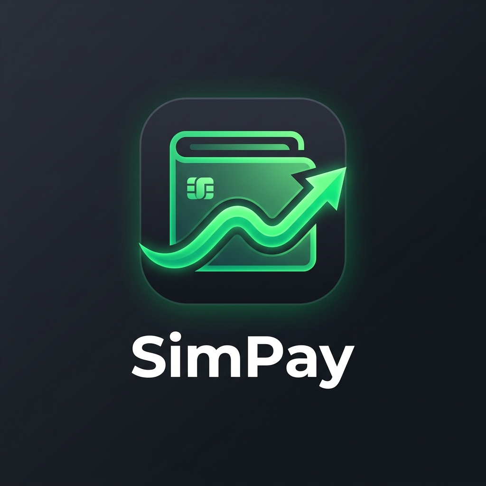

<p align="center">
  
</p>

<h1 align="center">SimPay 💸</h1>

<p align="center">
  <i>"Catat masuknya dikit, keluarnya banyak."</i>
</p>

<p align="center">
  
  
  
</p>

---

## Apaan sih ini?

**SimPay** adalah aplikasi catat keuangan pribadi buat kalian yang pengen tau duit kalian lari kemana — tanpa ribet, tanpa internet, dan tanpa drama. Murni offline, ringan, dan tampilannya nggak bikin mata sakit.

Cocok banget buat lo yang sering ngerasa *"kok duit saya abis ya padahal baru gajian"* 💀

---

## Fitur yang Ada ✨

**💰 Catat Pemasukan & Pengeluaran**
Tinggal input nominal, pilih kategori, kasih catatan. Selesai. Simpel banget.

**🎯 Budget Bulanan & Per Kategori**
Set batas pengeluaran kalian biar nggak jebol. Ada indikator warna biar kalian langsung tau statusnya — hijau aman, merah bahaya.

**📊 Grafik & Diagram**
Liat distribusi pengeluaran kalian lewat donat chart dan grafik tren bulanan. Biar kalian ngerasa kayak orang dewasa 🧑‍💼

**🎁 Financial Wrapped**
Ala-ala Spotify Wrapped tapi versi dompet kalian. Muncul tiap awal bulan, recap keuangan kalian bulan lalu secara dramatis plus kasih tau persona belanja anda (*The Foodie* 🍜, *Subscription Addict* 📱, dll.). Bisa di-share juga!

**👁️ Mode Samaran**
Sembunyiin semua nominal jadi Rp ••••••  biar nggak ketauan pas lagi di depan orang. Privacy is everything 🤫

**🖨️ Cetak Laporan PDF**
Butuh bukti pengeluaran? Langsung cetak jadi PDF dari HP. Profesional banget padahal.

---

## Download Sekarang 📲

### 🤖 Android

> Gratis | Offline | ~23 MB

### 👉 [Download SimPay v1.2.0](https://i.diawi.com/7uxTWa)

*Buka link di atas dari browser HP Android kalian, atau scan QR Code di halaman tersebut buat langsung install.*

---

### 🍎 iOS (iPhone/iPad)

Sayangnya belum ada link install langsung buat iOS, karena build IPA butuh **Mac + Xcode** — dan itu nggak bisa dari Windows 😭

Tapi kalau kalian pengen tetap nyoba di iPhone, ini caranya:

**1. kalian punya Mac sendiri / punya temen yang punya Mac:**
```bash
# Clone / copy project ini ke Mac, lalu jalankan:
flutter build ipa
```
Terus install via **AltStore** atau **Xcode** ke iPhone kalian.

**2. Pakai layanan cloud build (gratis):**
- Upload project ke **[Codemagic](https://codemagic.io)** atau **GitHub Actions** dengan Mac runner
- Mereka yang build IPA-nya, lo tinggal download hasilnya

**3. Cara paling gampang — pakai TestFlight:**
Kalau ada yang mau distribute lewat Apple TestFlight, butuh Apple Developer Account ($99/tahun). Agak ribet, tapi ini cara resminya.

> **TLDR**: Kode-nya siap iOS, tapi build-nya butuh Mac. Kalau kalian pakai Android, langsung aja download link di atas! 👆

---

<p align="center">Made with ☕ & Flutter &nbsp;|&nbsp; <b>SimPay v1.2.0</b></p>
